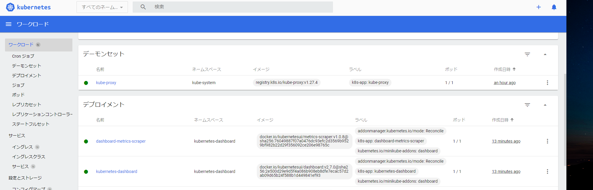

# minikube start
minikube version: v1.31.2

[minikube公式の手順](https://minikube.sigs.k8s.io/docs/start/)を参考にしてインストールして動かくか確認

## 環境

- Windows 11
- WSL2
- Ubuntu 20.04.6 LTS

## インストール

``` sh
$ cd [WORK-DIR]
$ curl -LO https://storage.googleapis.com/minikube/releases/latest/minikube-linux-amd64
$ sudo install minikube-linux-amd64 /usr/local/bin/minikube
```

## 稼働確認

### バージョン確認

``` shell
$ minikube version
minikube version: v1.31.2
commit: fd7ecd9c4599bef9f04c0986c4a0187f98a4396e
```

### クラスターの開始

``` shell
$ minikube start
😄  minikube v1.31.2 on Ubuntu 20.04 (amd64)
👎  Unable to pick a default driver. Here is what was considered, in preference order:
    ▪ docker: Not healthy: "docker version --format {{.Server.Os}}-{{.Server.Version}}:{{.Server.Platform.Name}}" exit status 1: Cannot connect to the Docker daemon at unix:///var/run/docker.sock. Is the docker daemon running?
    ▪ docker: Suggestion: Start the Docker service <https://minikube.sigs.k8s.io/docs/drivers/docker/>
💡  Alternatively you could install one of these drivers:
    ▪ kvm2: Not installed: exec: "virsh": executable file not found in $PATH
    ▪ podman: Not installed: exec: "podman": executable file not found in $PATH
    ▪ qemu2: Not installed: exec: "qemu-system-x86_64": executable file not found in $PATH
    ▪ virtualbox: Not installed: unable to find VBoxManage in $PATH

❌  Exiting due to DRV_DOCKER_NOT_RUNNING: Found docker, but the docker service isn't running. Try restarting the docker service.
```
失敗した。
dockerが起動していなかったので、起動して再度クラスター開始。

```shell
$ sudo service docker start
$ minikube start
😄  minikube v1.31.2 on Ubuntu 20.04 (amd64)
✨  Automatically selected the docker driver. Other choices: ssh, none
📌  Using Docker driver with root privileges
👍  Starting control plane node minikube in cluster minikube
🚜  Pulling base image ...
💾  Downloading Kubernetes v1.27.4 preload ...
    > gcr.io/k8s-minikube/kicbase...:  447.62 MiB / 447.62 MiB  100.00% 2.96 Mi
    > preloaded-images-k8s-v18-v1...:  393.21 MiB / 393.21 MiB  100.00% 2.52 Mi
🔥  Creating docker container (CPUs=2, Memory=2200MB) ...
🐳  Preparing Kubernetes v1.27.4 on Docker 24.0.4 ...
    ▪ Generating certificates and keys ...
    ▪ Booting up control plane ...
    ▪ Configuring RBAC rules ...
🔗  Configuring bridge CNI (Container Networking Interface) ...
    ▪ Using image gcr.io/k8s-minikube/storage-provisioner:v5
🔎  Verifying Kubernetes components...
🌟  Enabled addons: default-storageclass, storage-provisioner
💡  kubectl not found. If you need it, try: 'minikube kubectl -- get pods -A'
🏄  Done! kubectl is now configured to use "minikube" cluster and "default" namespace by default
```

kubectlが必要なら`minikube kubectl -- get pods -A`を実行してと書かれているので実行

```shell
$ minikube kubectl -- get po -A
    > kubectl.sha256:  64 B / 64 B [-------------------------] 100.00% ? p/s 0s
    > kubectl:  46.98 MiB / 46.98 MiB [--------------] 100.00% 1.00 MiB p/s 47s
NAMESPACE     NAME                               READY   STATUS    RESTARTS      AGE
kube-system   coredns-5d78c9869d-g89th           1/1     Running   0             37m
kube-system   etcd-minikube                      1/1     Running   0             38m
kube-system   kube-apiserver-minikube            1/1     Running   0             38m
kube-system   kube-controller-manager-minikube   1/1     Running   0             38m
kube-system   kube-proxy-8kl7r                   1/1     Running   0             37m
kube-system   kube-scheduler-minikube            1/1     Running   0             38m
kube-system   storage-provisioner                1/1     Running   1 (37m ago)   38m
```

コマンドがインストールとpodの情報が取得できた。

### ダッシュボードの起動

```shell
minikube dashboard --url
🤔  Verifying dashboard health ...
🚀  Launching proxy ...
🤔  Verifying proxy health ...
http://127.0.0.1:43057/api/v1/namespaces/kubernetes-dashboard/services/http:kubernetes-dashboard:/proxy/
```
初回はdashbord用のpodが立ち上がるまで10分くらいかかった。


こんな感じでダッシュボードが立ち上がる。


### クラスターの停止

```shell
$ minikube stop
✋  Stopping node "minikube"  ...
🛑  Powering off "minikube" via SSH ...
🛑  1 node stopped.
```
